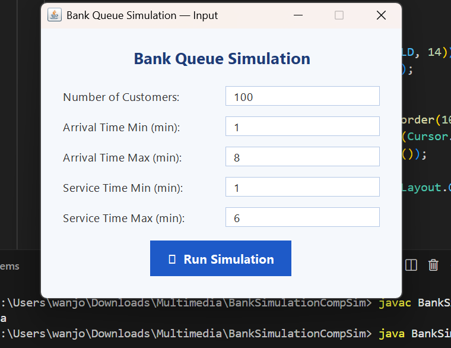
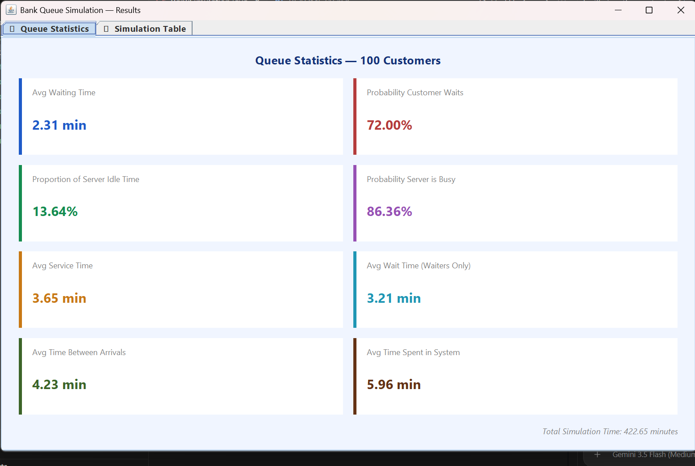
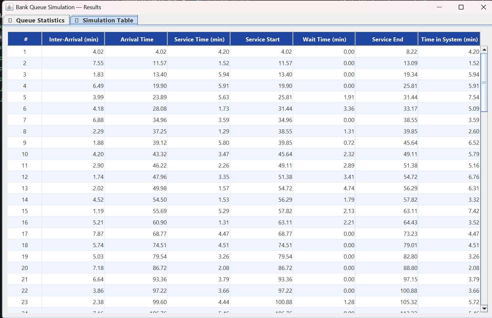

# Bank Queue Simulation

A Java Swing application that simulates a **single-server bank queue** using randomly generated arrival and service times. Simply enter the simulation parameters, run it, and view both summary statistics and a detailed customer-by-customer breakdown.

##  Screenshots

| Input Window | Statistics | Simulation Table |
|--------------|------------|------------------|
| Set simulation parameters | View queue performance | Inspect each customer's journey |

##  Team

- 156740 Benson Gitonga
- 159740 Joy Wanjohi
- 169962 Muhammed Abdalla
- 169004 Ilhan Hamud
- 154210 Elvis Wafula
- 150851 Melissa Ndeti

##  Features

- Adjustable number of customers and time ranges
- Uniform random generation of arrival and service times
- Instant calculation of key queue performance metrics
- Detailed simulation table for every customer
- Simple, responsive Java Swing interface

##  Statistics Generated

After every simulation, the application calculates:

- Average waiting time
- Probability that a customer waits
- Server utilization
- Server idle time
- Average service time
- Average waiting time (customers who waited only)
- Average time between arrivals
- Average time spent in the system